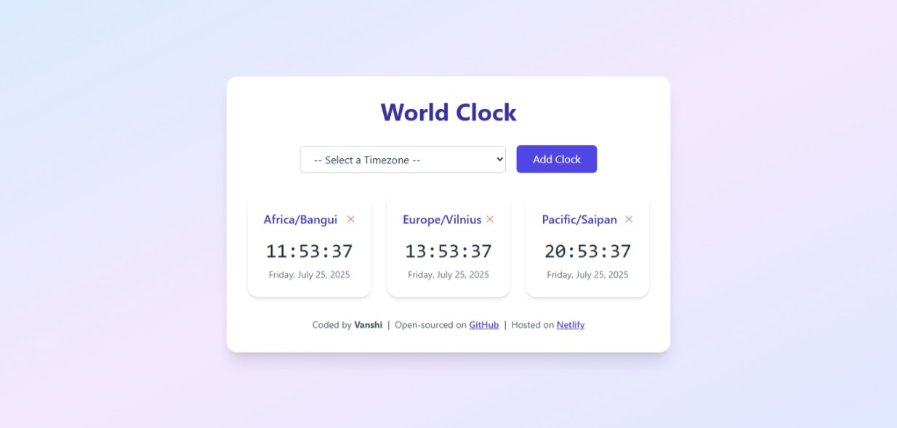

#  React World Clock

A sleek and lightweight world clock app built using **React + TypeScript + Vite**, allowing users to track real-time timezones across different cities globally. No third-party time APIs are used — all logic is handled with JavaScript's built-in `Date` and timezone features.

## Introduction
**Hosted** [World-Clock](https://react-world-clock-vanshi.vercel.app/)

**LinkedIn:** [Vanshi](https://www.linkedin.com/in/vanshi-puri)

Created by Vanshi in July 2025

---



##  Tech Stack

-  React
-  TypeScript
-  Vite
-  Tailwind 
- JavaScript `Date` object for timezone handling
- LocalStorage for saving user clocks

---

##  Features

-  Add any timezone through dropdown menu
-  Automatically displays local time based on timezone
-  Real-time time updates (every second)
-  Delete clocks you no longer want to track
-  Clocks persist across page refresh (stored in localStorage)
-  Clean and responsive UI

---


### Clone the repository

```bash
# 1. Clone the repository
git clone https://github.com/vanshipuri/react-world-clock
cd react-world-clock

# 2. Install all dependencies
npm install

# 3. Start the server
npm run dev```
